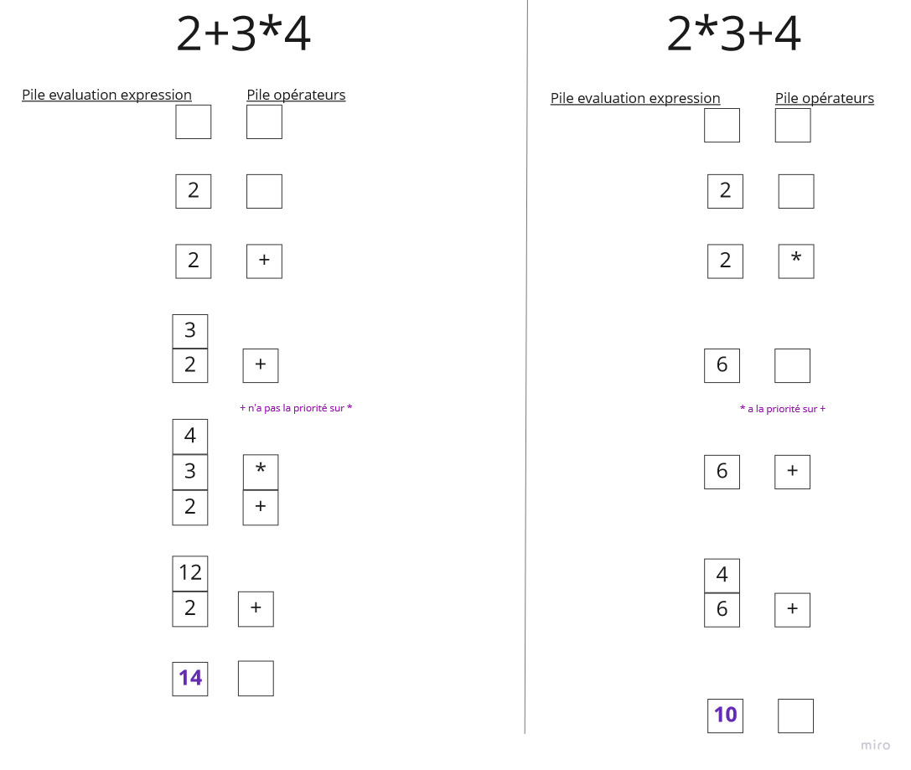

# Calculatrice

## Présentation

Il s'agit ici d'une version simplifée :

-   Calculs sur les réels

-   Opérations arithmétiques élémentaires :
    -   Division
    -   Multiplication
    -   Addition
    -   Soustraction

-   Possibilité d'effacer le dernier caractère saisi

-   Reprendre le calcul à partir de la dernière valeur calculée.

## Méthode d'évaluation d'une expression artithmétique

L'expression **expression** est stockée sous forme de chaîne de caractères.
Deux piles sont initialisées : 
-   **ops** : stocke des opérateurs : + - * / 
-   **pileExpression** : stocke les valeurs sucessives de **expression**
Plus précisèment, lors de la lecture de chacun des caractères si 
c'est un opérateur (opi), alors soit
l'opérateur au sommet de la pile **ops** est prioritaire par rapport à opi et 
val1 est dépilée de **pileExpression** , val2 est dépilée de **pileExpression**, le nouveau sommet de **pileExpression** devient
val1 op val2.
soit il ne l'est pas et opi est simplement stockée dans la pile **ops**

si c'est un chiffre il est lu et cette lecture continue tant que le carcactère suivant est lui aussi un nombre ou un . (pour pouvoir stocker des réels)

si c'est une parenthèse ouvrante

si c'est une parenthèse fermante
-   

## Exemples

Illustrations de ce qui se passe au niveau de la pile des opérateurs et de la pile servant à stocker les résultats successifs de l'évaluation d'une expression.   

Ces résultats sont aussi observables dans le fichier généré par les logs : **logs/logPileCalculs.log**   

## Utilisation :

-   Cloner le projet
-   Dans un terminal : java -jar .\app\build\libs\app-0.1.0.jar
